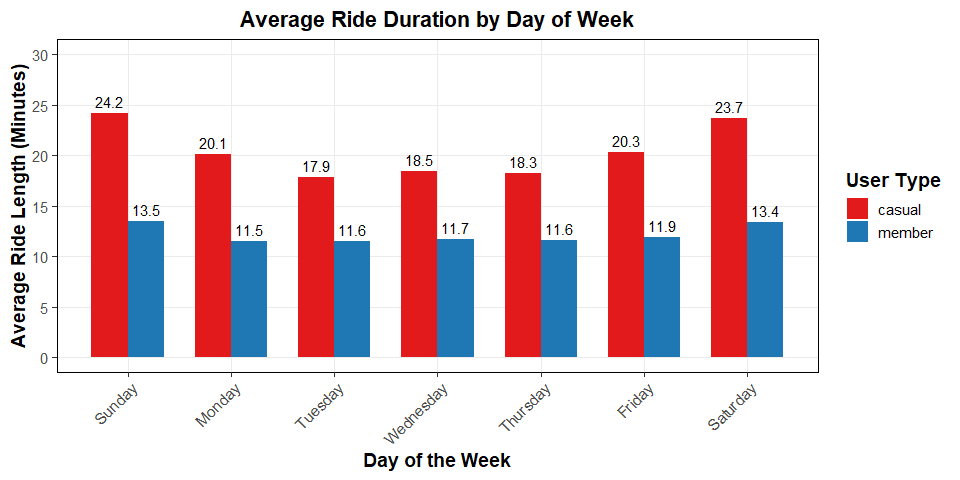
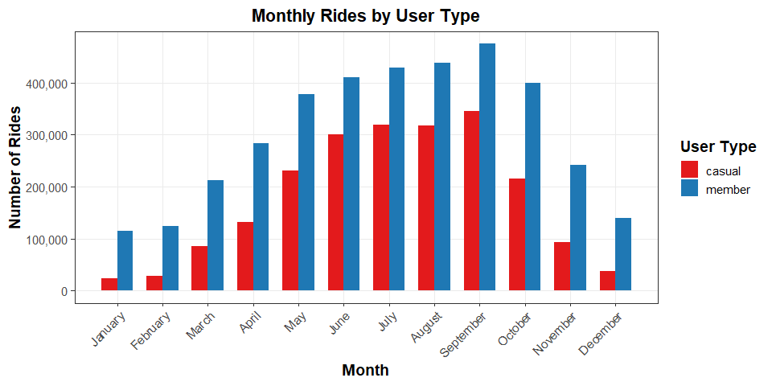
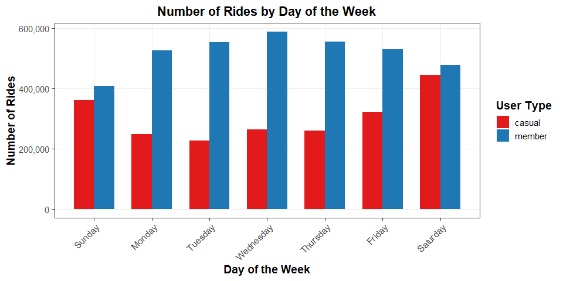
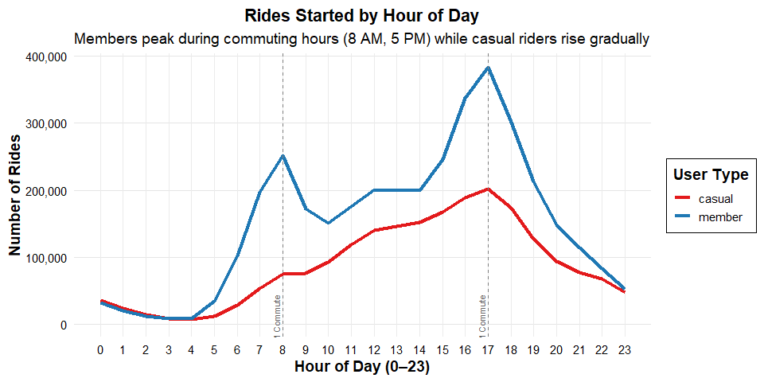
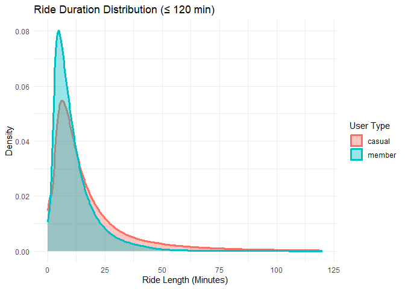

# Bike_share_analysis

# 📌 Introduction

This case study examines how Cyclistic, a bike-share company based in
Chicago, can increase its annual membership by analyzing the riding
behaviors of casual users. The objective is to identify the differences
between casual riders and annual members, using these insights to
develop a data-driven marketing strategy. The project utilizes public
trip data from Cyclistic’s operations over the past year and employs
data cleaning, analysis, and visualization techniques using R. It
operates under the assumption that casual riders may be converted into
members if their usage patterns and preferences are better understood.

## 🔍 My Approach

- Documented the data cleaning and manipulation processes.
- Analyzed usage trends from April 2024 to March 2025.
- Presented visualizations.
- Provided recommendations.

# Data Analysis Process

## ✅ Ask: Identifying the Business Task

The goal is to identify trends in how annual members and casual riders
use bikes differently and design marketing strategies to convert casual
riders.

### 👥 Stakeholders

- Lily Moreno (Director of Marketing)
- Cyclistic Executive Team

## 📁 Prepare: Data Collection and ROCCC Check

For this case study, I downloaded trip data from April 2024 to March
2025 from the “<https://divvy-tripdata.s3.amazonaws.com/index.html>” a
publicly available dataset. This dataset was provided by Motivate
International Inc. and is governed by a license agreement. I evaluated
the dataset using the ROCCC standard: - Reliable – It is provided by
Motivate International Inc., Cyclistic’s official partner.

- **Original** – The data is raw and publicly available, serving as a
  primary data source.

- **Comprehensive** – It includes thirteen columns such as ride ID,
  start and end station names, and more, over 12 months.

- **Current** – The data covers the most recent 12-month period.

- **Cited** – The dataset is cited properly along with its licensing
  terms.

While reviewing the dataset, I observed some issues—rows with missing
start or end stations, and entries where the start time occurred after
the end time.

## 🧹 Process: Cleaning and Preparing the Data

I chose R for this analysis because it allows me to clean, prepare,
organize, analyze, and visualize data efficiently in one environment. I
collected the dataset from the [Divvy Trip Data
Repository](https://divvy-tripdata.s3.amazonaws.com/index.html),
covering April 2024 to March 2025. The dataset meets the ROCCC standard.
Then i uploaded the datasets in R.

``` r
library(tidyverse)   # For dplyr, ggplot2, etc.
library(readr)       # For read_csv()
library(lubridate)   # For date and time handling
library(janitor)     # For clean_names() and data cleaning helpers
library(scales)
```

``` r
April_2024 <- (read.csv("D:/Case Study -  How does a bike-share navigate speedy success/Trip Data Files/202404-divvy-tripdata/202404-divvy-tripdata.csv"))
May_2024 <- (read.csv("D:/Case Study -  How does a bike-share navigate speedy success/Trip Data Files/202405-divvy-tripdata/202405-divvy-tripdata.csv"))
June_2024 <- (read.csv("D:/Case Study -  How does a bike-share navigate speedy success/Trip Data Files/202406-divvy-tripdata/202406-divvy-tripdata.csv"))
July_2024 <- (read.csv("D:/Case Study -  How does a bike-share navigate speedy success/Trip Data Files/202407-divvy-tripdata/202407-divvy-tripdata.csv"))
August_2024 <- (read.csv("D:/Case Study -  How does a bike-share navigate speedy success/Trip Data Files/202408-divvy-tripdata/202408-divvy-tripdata.csv"))
September_2024 <- (read.csv("D:/Case Study -  How does a bike-share navigate speedy success/Trip Data Files/202409-divvy-tripdata/202409-divvy-tripdata.csv"))
October_2024 <- (read.csv("D:/Case Study -  How does a bike-share navigate speedy success/Trip Data Files/202410-divvy-tripdata/202410-divvy-tripdata.csv"))
November_2024 <- (read.csv("D:/Case Study -  How does a bike-share navigate speedy success/Trip Data Files/202411-divvy-tripdata/202411-divvy-tripdata.csv"))
December_2024 <- (read.csv("D:/Case Study -  How does a bike-share navigate speedy success/Trip Data Files/202412-divvy-tripdata/202412-divvy-tripdata.csv"))
January_2025 <- (read.csv("D:/Case Study -  How does a bike-share navigate speedy success/Trip Data Files/202501-divvy-tripdata/202501-divvy-tripdata.csv"))
February_2025 <- (read.csv("D:/Case Study -  How does a bike-share navigate speedy success/Trip Data Files/202502-divvy-tripdata/202502-divvy-tripdata.csv"))
March_2025 <- (read.csv("D:/Case Study -  How does a bike-share navigate speedy success/Trip Data Files/202503-divvy-tripdata/202503-divvy-tripdata.csv"))
```

Before moving into cleaning and analysis, I ensured the data was
**accurate and consistent** across all 12 files by checking column names
and data types.

``` r
# Check column names and structure
colnames(April_2024)
```

    ##  [1] "ride_id"            "rideable_type"      "started_at"        
    ##  [4] "ended_at"           "start_station_name" "start_station_id"  
    ##  [7] "end_station_name"   "end_station_id"     "start_lat"         
    ## [10] "start_lng"          "end_lat"            "end_lng"           
    ## [13] "member_casual"

``` r
colnames(May_2024)
```

    ##  [1] "ride_id"            "rideable_type"      "started_at"        
    ##  [4] "ended_at"           "start_station_name" "start_station_id"  
    ##  [7] "end_station_name"   "end_station_id"     "start_lat"         
    ## [10] "start_lng"          "end_lat"            "end_lng"           
    ## [13] "member_casual"

``` r
colnames(June_2024)
```

    ##  [1] "ride_id"            "rideable_type"      "started_at"        
    ##  [4] "ended_at"           "start_station_name" "start_station_id"  
    ##  [7] "end_station_name"   "end_station_id"     "start_lat"         
    ## [10] "start_lng"          "end_lat"            "end_lng"           
    ## [13] "member_casual"

``` r
colnames(July_2024)
```

    ##  [1] "ride_id"            "rideable_type"      "started_at"        
    ##  [4] "ended_at"           "start_station_name" "start_station_id"  
    ##  [7] "end_station_name"   "end_station_id"     "start_lat"         
    ## [10] "start_lng"          "end_lat"            "end_lng"           
    ## [13] "member_casual"

``` r
colnames(August_2024)
```

    ##  [1] "ride_id"            "rideable_type"      "started_at"        
    ##  [4] "ended_at"           "start_station_name" "start_station_id"  
    ##  [7] "end_station_name"   "end_station_id"     "start_lat"         
    ## [10] "start_lng"          "end_lat"            "end_lng"           
    ## [13] "member_casual"

``` r
colnames(September_2024)
```

    ##  [1] "ride_id"            "rideable_type"      "started_at"        
    ##  [4] "ended_at"           "start_station_name" "start_station_id"  
    ##  [7] "end_station_name"   "end_station_id"     "start_lat"         
    ## [10] "start_lng"          "end_lat"            "end_lng"           
    ## [13] "member_casual"

``` r
colnames(October_2024)
```

    ##  [1] "ride_id"            "rideable_type"      "started_at"        
    ##  [4] "ended_at"           "start_station_name" "start_station_id"  
    ##  [7] "end_station_name"   "end_station_id"     "start_lat"         
    ## [10] "start_lng"          "end_lat"            "end_lng"           
    ## [13] "member_casual"

``` r
colnames(November_2024)
```

    ##  [1] "ride_id"            "rideable_type"      "started_at"        
    ##  [4] "ended_at"           "start_station_name" "start_station_id"  
    ##  [7] "end_station_name"   "end_station_id"     "start_lat"         
    ## [10] "start_lng"          "end_lat"            "end_lng"           
    ## [13] "member_casual"

``` r
colnames(December_2024)
```

    ##  [1] "ride_id"            "rideable_type"      "started_at"        
    ##  [4] "ended_at"           "start_station_name" "start_station_id"  
    ##  [7] "end_station_name"   "end_station_id"     "start_lat"         
    ## [10] "start_lng"          "end_lat"            "end_lng"           
    ## [13] "member_casual"

``` r
colnames(January_2025)
```

    ##  [1] "ride_id"            "rideable_type"      "started_at"        
    ##  [4] "ended_at"           "start_station_name" "start_station_id"  
    ##  [7] "end_station_name"   "end_station_id"     "start_lat"         
    ## [10] "start_lng"          "end_lat"            "end_lng"           
    ## [13] "member_casual"

``` r
colnames(February_2025)
```

    ##  [1] "ride_id"            "rideable_type"      "started_at"        
    ##  [4] "ended_at"           "start_station_name" "start_station_id"  
    ##  [7] "end_station_name"   "end_station_id"     "start_lat"         
    ## [10] "start_lng"          "end_lat"            "end_lng"           
    ## [13] "member_casual"

``` r
colnames(March_2025)
```

    ##  [1] "ride_id"            "rideable_type"      "started_at"        
    ##  [4] "ended_at"           "start_station_name" "start_station_id"  
    ##  [7] "end_station_name"   "end_station_id"     "start_lat"         
    ## [10] "start_lng"          "end_lat"            "end_lng"           
    ## [13] "member_casual"

After confirming structural alignment, I created a unified data frame by
combining all the monthly datasets. The next code block performs this
merging using the rbind() function. I then calculated the total number
of rows—5,779,568 rows across thirteen columns—giving me a sense of the
dataset’s size.

``` r
# Combine all datasets into one
trip_data_202425 <- rbind(April_2024,May_2024,June_2024,July_2024,August_2024,September_2024,October_2024,November_2024,December_2024,January_2025,February_2025,March_2025)
```

To begin cleaning, I removed rows where the data was incomplete or
incorrect. Specifically, I removed 492 rows where the start time was
after the end time and 6,589 rows where essential values were missing.
And changed converted time columns to date and time format from
character format.

``` r
clean_trip_data_2024_25 <- trip_data_202425 %>% filter(ended_at > started_at)
clean_trip_data_2024_25 <- na.omit(clean_trip_data_2024_25)
```

``` r
clean_trip_data_2024_25$started_at <- ymd_hms(clean_trip_data_2024_25$started_at)
clean_trip_data_2024_25$ended_at <- ymd_hms(clean_trip_data_2024_25$ended_at)
```

Once cleaned, I calculated the ride lengths in minutes for each entry
using the difftime() function. To facilitate analysis, I also created
new columns such as day of the week, month, year, date, and hour of the
ride, which I did using functions from the lubridate package. Each of
these transformations is introduced with code that clearly describes the
operation.

``` r
clean_trip_data_2024_25<- clean_trip_data_2024_25 %>%
  mutate(
    ride_length = as.numeric(difftime(ended_at, started_at, units = "mins")),
    day_of_week = wday(started_at, label = FALSE),
    month = month(started_at, label = FALSE),
    year = year(started_at),
    date = as.Date(started_at),
    hour = hour(started_at),
    time = format(started_at, format = "%H:%M"))
```

## 📊 Analyse

In the Analyse phase, I explored how casual and member riders differ in
terms of ride duration, frequency, and seasonal usage. This helps
Cyclistic understand key behavioral trends that can shape targeted
marketing strategies.

### 🔸 Average Ride Duration by User Type

This analysis was conducted to compare how ride duration patterns vary
between members and casual users. Understanding these differences helps
identify usage behavior, which can inform user segmentation, service
design, and marketing strategies.

``` r
avg_ride <- clean_trip_data_2024_25 %>%  group_by(member_casual) %>% summarise(avg_ride_length = mean(ride_length))
```

### 🔸 Number of Rides by Day of the Week

This analysis aims to explore how ride frequency varies across the days
of the week for different user types. Identifying daily usage trends
helps in understanding peak demand periods, planning resource
allocation, and tailoring services to user behavior patterns.

``` r
rides_by_day <- clean_trip_data_2024_25 %>%
  count(day_of_week, member_casual)
```

### 🔸 Average Ride Duration per Day

This chart helps us see how ride times change across the week. It gives
clues about when people are riding just to get somewhere and when
they’re taking their time—like on weekends. This helps in understanding
how the service is used on different days.

``` r
avg_by_day <- clean_trip_data_2024_25 %>%
  group_by(member_casual, day_of_week) %>%
  summarise(avg_length = mean(ride_length))
```

    ## `summarise()` has grouped output by 'member_casual'. You can override using the
    ## `.groups` argument.

### 🔸 Monthly Ride Count

This analysis looks at how the number of rides changes from month to
month. It helps us understand seasonal patterns and how weather or time
of year might affect how often people use the service.

``` r
monthly_rides <- clean_trip_data_2024_25%>%
  count(month, member_casual)
```

## 📈 Share

To effectively communicate the analysis results, I created a series of
visualizations using the `ggplot2` package. These visuals help identify
trends in user behavior, making insights clearer for both technical and
non-technical stakeholders.

### 🔹 Average Ride Duration by Day of the Week

This plot compares how long casual riders and members ride on each day.

<!-- -->

The plot above conveys that casual riders consistently take longer trips
than members, with their ride durations peaking on weekends—particularly
on Sundays and Saturdays. This trend indicates that casual users likely
use the service for leisure purposes. In contrast, members exhibit
shorter and more consistent ride durations across all days of the week,
suggesting usage primarily for commuting or other routine activities.

### 🔹 Monthly Ride Volume by User Type

<!-- -->

The plot above highlights a clear seasonal trend in ride usage for both
user types, with activity peaking during the summer months from June to
September. Casual riders, in particular, show a strong sensitivity to
weather, as their numbers drop sharply during the colder winter months.
In contrast, members maintain a steadier level of usage throughout the
year. This pattern suggests that casual riders primarily engage in
recreational biking during pleasant weather, while members are more
consistent users—likely relying on the service for regular commuting or
daily travel needs.

### 🔹 Number of Rides by Day of the Week

<!-- -->

The plot above illustrates distinct usage patterns between members and
casual riders. Members ride most frequently during weekdays, with a
noticeable peak in the middle of the week—aligning closely with typical
commuting routines. In contrast, casual riders show a clear preference
for weekends, especially Saturdays and Sundays, reinforcing their
tendency to use the service for recreational purposes. This behavioral
distinction is crucial for targeted marketing strategies and informed
operational planning, allowing for more efficient resource allocation
based on user type and day of the week.

### 🔹 Rides Started by Hour of Day

<!-- -->

The plot above shows distinct time-of-day usage patterns between members
and casual riders. Member activity features sharp peaks around 8 AM and
5 PM, which align with standard commuting hours, indicating a functional
and time-bound usage. In contrast, casual rider activity gradually
increases throughout the day, reaching its peak around 4 to 5 PM. This
suggests that casual users engage with the service more flexibly, likely
for leisure or spontaneous trips rather than scheduled travel.

### 🔹 Ride Duration Distribution Plot

<!-- -->

The plot above reveals that most rides fall within a short duration of 5
to 10 minutes. However, casual users display a much broader
distribution, with a significant number of longer rides. This suggests
that casual riders may be using the service to explore, relax, or travel
longer distances at a leisurely pace. In contrast, member ride durations
are tightly clustered within the shorter range, reinforcing the idea
that they prioritize efficiency—likely using the bikes for quick,
purpose-driven trips such as commuting.

## 🚀 Act

The ACT phase of the analysis involves using insights gained from the
previous data exploration and visualization steps to make informed
decisions or take actionable steps. This phase will focus on applying
the findings from our previous analysis of ride duration, usage
patterns, and user behavior to optimize the bike-sharing service’s
operations and marketing strategies.

### Key Insights from Previous Analysis

1.  **Casual Riders vs. Members**: Casual riders tend to take longer
    trips, especially on weekends, while members have shorter, more
    consistent ride durations.
2.  **Seasonality**: Both user types show strong seasonality, with usage
    peaking during the summer months (June to September). Casual riders
    are more sensitive to weather conditions, while members maintain
    steadier usage year-round.
3.  **Time-of-Day Usage**: Member usage peaks during weekdays,
    especially at 8 AM and 5 PM, aligning with typical commuting hours.
    Casual rider activity peaks on weekends and rises steadily
    throughout the day.
4.  **Ride Duration**: Most rides are short (5-10 minutes), but casual
    riders tend to have a broader range of ride durations, including
    many longer trips.

### Actionable Recommendations

Based on these insights, several recommendations can be made:

#### 1. **Targeted Marketing Campaigns for Casual Riders**

- **Leisure Focus**: Marketing campaigns aimed at casual riders should
  emphasize leisure and weekend activities, such as scenic routes or
  weekend deals.
- **Weather-Dependent Promotions**: Since casual riders are more
  weather-sensitive, seasonal promotions or discounts could be offered
  during the summer months to encourage more rides.

#### 2. **Seasonal Adjustments in Operations**

- **Fleet Adjustments**: During peak summer months, increase the fleet
  of bikes available, especially in areas with high casual rider
  traffic. Conversely, consider reducing fleet size during the winter to
  optimize operational costs.
- **Weather-Responsive Operations**: Implement real-time monitoring of
  weather forecasts to adjust bike availability for casual riders. For
  example, offer incentives during sunny days to boost usage.

#### 3. **Operational Efficiency for Short Rides**

- **Quick Rentals**: Since most rides are short, streamline the rental
  process and increase the availability of bikes near high-traffic,
  short-trip areas (e.g., business districts or transit stations).
- **Focus on Efficiency for Members**: Ensure that members have quick
  access to bikes with minimal hassle, supporting their need for
  efficient and timely travel.
